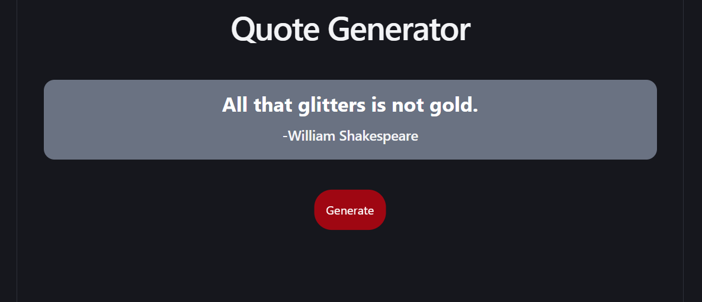

# Quote Generator
## A simple React application that displays a random inspirational quote each time the user clicks the Generate button.

This project was built while learning React and the useState hook. It focuses on state management, random number generation, and basic UI development with Tailwind CSS. Built with **React** to practice React fundamentals such as state management, event handling, arrays, objects, and conditional rendering.

### 📸 Screenshot


##  Features

-  Generate a random quote with a single click
-  Display both the quote and its author
-  Prevents the same quote from appearing twice in a row
-  Built using React Hooks (`useState`)
-  Clean and responsive UI with Tailwind CSS

##  Tech Stack

- React
- Vite
- JavaScript (ES6+)
- Tailwind CSS

##  What I Learned

This project helped me practice:

- React `useState`
- Managing state efficiently
- Working with arrays of objects
- Rendering dynamic content
- Event handling in React
- JavaScript random number generation
- Preventing duplicate random selections
- Writing cleaner and more maintainable React code

##  Folder Structure

```text
src/
├── App.jsx
├── main.jsx
└── index.css
```

##  Installation

Clone the repository:

```bash
git clone https://github.com/VibhutinandSingh/react-random-quote-generator.git
```

Go to the project directory:

```bash
cd react-random-quote-generator
```

Install dependencies:

```bash
npm install
```

Start the development server:

```bash
npm run dev
```

##  Future Improvements

-  Copy quote to clipboard
-  Save favorite quotes
-  Light/Dark mode toggle
-  Quote categories
-  Fetch quotes from an external API
-  Add animations during quote transitions
-  Improve mobile responsiveness

##  Author

**Vibhutinand Singh**

First-year B.Tech student passionate about full-stack web development and building real-world projects to strengthen my skills.

---

If you found this project interesting, consider giving it a ⭐ on GitHub!
